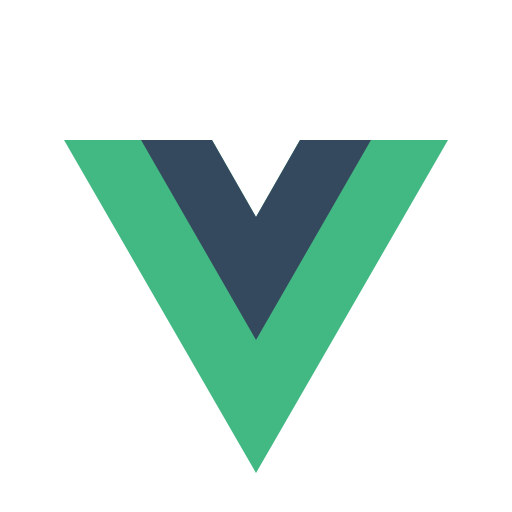
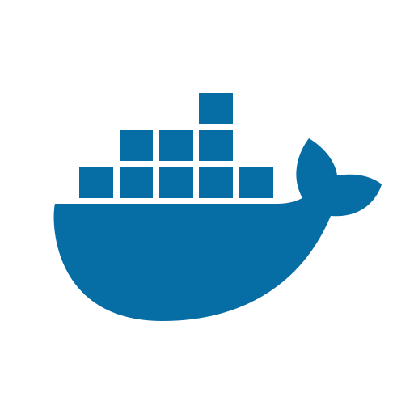
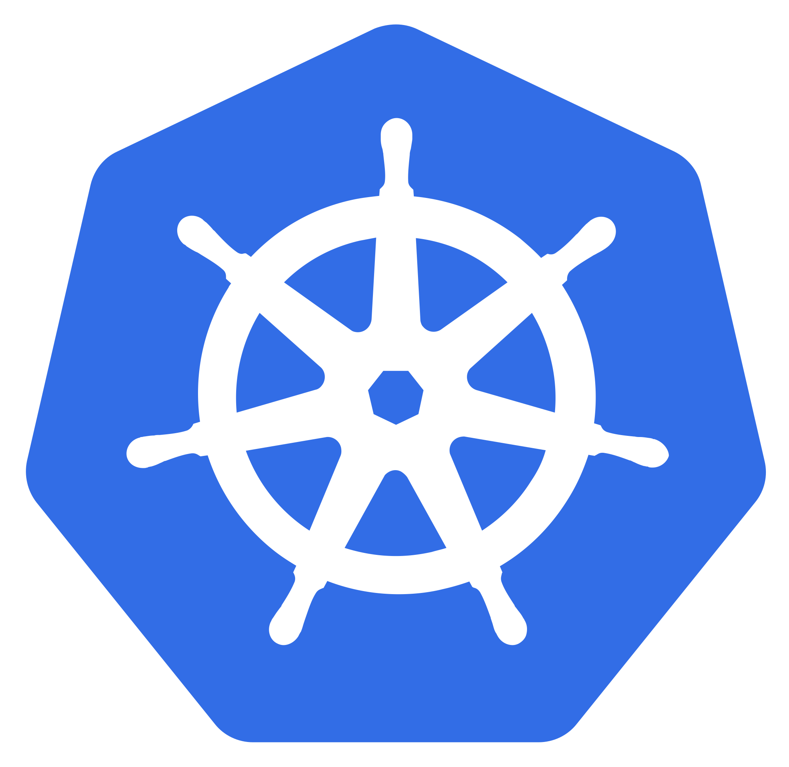

### Hi there 👋

#### I'm a Software Engineer.
#### I'm currently building free online learning platform called  Cloudtutor.io.

- ⚙️ I use daily : 
 python, 
 django,
 fastapi,
vue,
 react,
 docker,
 kubernetes,
 google cloud

Link: https://cloudtutor.io
